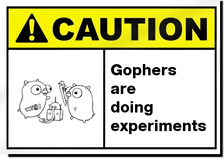

# arc

[](https://github.com/FollowTheProcess/arc)
[](https://goreportcard.com/report/github.com/FollowTheProcess/arc)
[](https://github.com/FollowTheProcess/arc)
[](https://github.com/FollowTheProcess/arc/actions?query=workflow%3ACI)
[](https://codecov.io/gh/FollowTheProcess/arc)

*The shortest path from request to response* 🌐

> [!WARNING]
> **arc is in early development and is not yet ready for use**



## Project Description

`arc` is a command line API Client and testing tool, driven by plaintext `.http` files.

## Installation

Compiled binaries for all supported platforms can be found in the [GitHub release]. There is also a [homebrew] tap:

```shell
brew install --cask FollowTheProcess/tap/arc
```

## Quickstart

### Credits

This package was created with [copier] and the [FollowTheProcess/go-template] project template.

[copier]: https://copier.readthedocs.io/en/stable/
[FollowTheProcess/go-template]: https://github.com/FollowTheProcess/go-template
[GitHub release]: https://github.com/FollowTheProcess/arc/releases
[homebrew]: https://brew.sh
